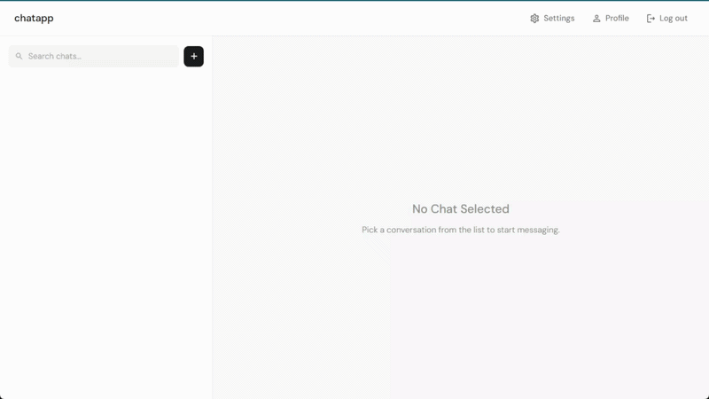

# Chat Application

## Demo

## Overview

A real-time chat application where registered users can connect, authenticate, and exchange messages instantly with other users on the platform.

## Features

- **User Registration & Authentication** - Secure signup/login with JWT
- **Real-time Messaging** - Instant message delivery via Socket.IO
- **Online Status** - See which users are currently active
- **Message History** - Access previous conversations

## Tech Stack

**Frontend:**
- React 19 with TypeScript
- Vite (build tool)
- TailwindCSS & Material-UI (styling)
- Socket.IO Client (real-time communication)
- React Router (navigation)
- React Hook Form & Zod (form validation)
- Zustand (state management)
- React Query (data fetching)

**Backend:**
- Node.js with Express
- PostgreSQL (database)
- Socket.IO (WebSocket communication)
- JWT (authentication)
- Bcrypt (password hashing)
